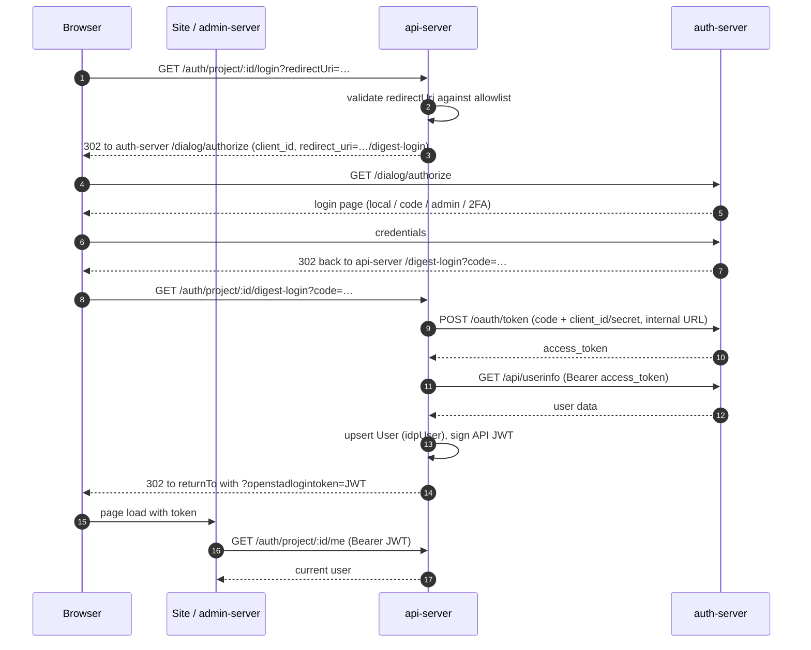

# auth-server

`apps/auth-server` — OAuth2 authorization server (SSO) for OpenStad. Handles login flows,
token issuance, and OAuth clients per project.

## Stack

- Express 4, plain JavaScript (CommonJS), **not** under `src/` — flat layout
- **oauth2orize** + **Passport** strategies (local, http, bearer, auth-token, client-password)
- Sequelize 6 on MySQL; migrations via umzug in `migrations/`; sessions via
  `express-session` + `express-mysql-session`
- Server-rendered login pages: Nunjucks/EJS views in `views/` + `nunjucks/`
- JWT access tokens signed with RSA keys in `certs/` (generated with openssl; CI generates its own)
- 2FA via `node-2fa` + `qrcode`; CSS built with LESS
- Entry point: `app.js` → `app-init.js`

## Directory map

| Folder/file                                                    | Purpose                                                                                                       |
| -------------------------------------------------------------- | ------------------------------------------------------------------------------------------------------------- |
| `routes/routes.js`                                             | All route definitions (OAuth endpoints, login pages, admin API)                                               |
| `controllers/oauth/`                                           | `oauth2.js` (authorize/decision), `token.js` (tokeninfo/revoke)                                               |
| `controllers/auth/`, `controllers/user/`, `controllers/admin/` | Login flow, user, and admin-API handlers                                                                      |
| `middleware/`                                                  | `auth.js`, `token.js`, `client.js`, `user.js`, `role.js`, `access-code.js`, `bruteForce.js`, `auditLog.js`, … |
| `model/`, `repositories/`                                      | Sequelize entities + access layer                                                                             |
| `config/`                                                      | `auth.js`, `index.js`, `roles.js`, `user.js`, `authValidation.js`                                             |
| `migrations/`, `seeds/`                                        | Schema + initial data (`init-database` / `migrate-database` scripts)                                          |

## Login methods

Local password (`/auth/local/login`), one-time URL (`/auth/url/login`), access/unique codes
(`/auth/code/login`), anonymous (`/auth/anonymous/login`), admin login (`/auth/admin/login`),
and two-factor (`/auth/two-factor/*`). Login pages support per-client styling and required
fields. Brute-force limiting and CSRF protection are applied on login routes.

## Key endpoints

| Endpoint                                      | Purpose                                                 |
| --------------------------------------------- | ------------------------------------------------------- |
| `GET /dialog/authorize`                       | OAuth2 authorization endpoint                           |
| `POST /oauth/token`                           | Token exchange (authorization code → access token)      |
| `GET /api/tokeninfo`                          | Validate an access token                                |
| `GET /api/userinfo?client_id=…`               | User data for the token holder (consumed by api-server) |
| `GET /api/admin/user/:id`, `/api/admin/users` | Admin user API (Basic auth `clientId:clientSecret`)     |
| `GET /logout?client_id=…`                     | Logout                                                  |

## Login flow (openstad adapter)

Three token types are involved:

1. **Authorization code** — short-lived, from `/dialog/authorize`
2. **Auth-server access token** — RSA-signed JWT from `/oauth/token`
3. **API session JWT** (`openstadlogintoken`) — HS-signed by the api-server with
   `AUTH_JWTSECRET`, carries `{userId, authProvider}`, used as `Bearer` on all API calls

The api-server side of this flow lives in `apps/api-server/src/adapter/openstad/`
(`router.js` for login/digest-login/logout redirects, `service.js` for the HTTP calls to the
auth-server) and `apps/api-server/src/middleware/user.js` (JWT verification on later requests).

## Integration points

- api-server exchanges codes and fetches user data over `serverUrlInternal`
  (`AUTH_ADAPTER_OPENSTAD_SERVERURL_INTERNAL`, Docker service name)
- admin-server is an OAuth client (`AUTH_ADMIN_CLIENT_ID`/`SECRET`); superuser rights come from
  being admin on the configured "Admin project" — see [doc/admin.md](../../doc/admin.md)
- Posts login/logout audit events to the api-server (`AUDIT_API_ENDPOINT`,
  `AUDIT_INTERNAL_TOKEN`)

## Notes

- A legacy `jest` config exists; write new unit tests with Vitest
  (`npm run test:unit:auth` from the root).
- The `engines` field in `package.json` (`node >=6.7.0`) is stale — the real runtime is Node 24.
