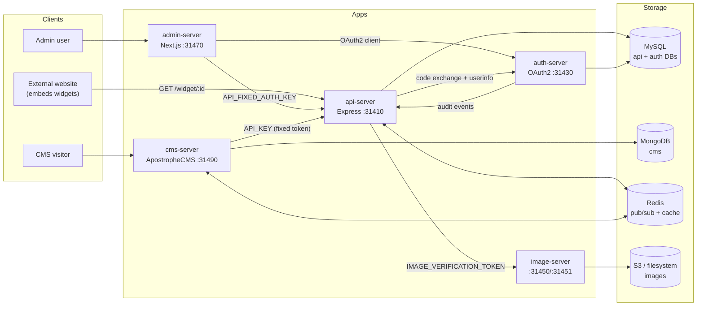

# Repository context

Monorepo for the OpenStad citizen participation platform. Default branch: `main`.
Node 24 (Docker base image `node:24-slim`), npm workspaces.

## Context index

- [REPO_CONTEXT.md](REPO_CONTEXT.md) — this file: repo map, architecture, ports
- [API_SERVER_CONTEXT.md](API_SERVER_CONTEXT.md) — Express REST API (Sequelize/MySQL)
- [AUTH_SERVER_CONTEXT.md](AUTH_SERVER_CONTEXT.md) — OAuth2 server + login flow diagram
- [ADMIN_SERVER_CONTEXT.md](ADMIN_SERVER_CONTEXT.md) — Next.js admin UI
- [CMS_SERVER_CONTEXT.md](CMS_SERVER_CONTEXT.md) — ApostropheCMS websites
- [IMAGE_SERVER_CONTEXT.md](IMAGE_SERVER_CONTEXT.md) — upload/resize server
- [WIDGETS_CONTEXT.md](WIDGETS_CONTEXT.md) — widget system + bundling/serving flow diagrams
- [TESTING.md](TESTING.md) — Vitest, Cypress, CI
- [CONVENTIONS.md](CONVENTIONS.md) — code conventions and accessibility

## Repo map

```
/apps                  Server applications (5, see per-app context files)
/packages              React widgets + shared libs (see WIDGETS_CONTEXT.md)
/packages/apostrophe-widgets  ApostropheCMS widgets for cms-server (separate system)
/doc                   Human documentation (setup, deployment, testing, audit logging, …)
/scripts               Repo automation: setup-all, start-all, init-databases, config generators
/cypress               E2E tests (root-level, not per app)
/charts/openstad-headless  Helm chart for Kubernetes deployment
/operations            Deployment scripts (Helm + SOPS-encrypted secrets)
/docker-compose*.yml   Local/dev/e2e/release orchestration
/Dockerfile            Single multi-stage build for all apps (ARG APP)
/package.json          Workspaces: apps/*, packages/*, packages/apostrophe-widgets/*
/vitest.config.ts      Root Vitest config (projects over all workspaces)
```

## Architecture



Inside Docker Compose, apps reach each other via service names:
`http://openstad-api-server:${API_PORT}`, `http://openstad-auth-server:${AUTH_PORT}`,
`http://openstad-image-server:${IMAGE_PORT_API}`. The Redis links are the message-streaming
pub/sub channel between api-server and cms-server (see [doc/message-streaming.md](../../doc/message-streaming.md)).

Shared secrets binding the services (env vars):

| Secret                                              | Between                                   |
| --------------------------------------------------- | ----------------------------------------- |
| `API_FIXED_AUTH_KEY`                                | admin-server / cms-server → api-server    |
| `AUTH_ADMIN_CLIENT_ID` / `AUTH_ADMIN_CLIENT_SECRET` | admin-server ↔ auth-server (OAuth client) |
| `AUTH_JWTSECRET`                                    | api-server JWT signing                    |
| `IMAGE_VERIFICATION_TOKEN`                          | api-server → image-server uploads         |
| `AUDIT_INTERNAL_TOKEN`                              | auth-server → api-server audit log        |

## Ports (defaults from `.testing.env`, base 31400)

| Service                    | Env var                   | Port  |
| -------------------------- | ------------------------- | ----- |
| api-server                 | `API_PORT`                | 31410 |
| auth-server                | `AUTH_PORT`               | 31430 |
| image-server upload API    | `IMAGE_PORT_API`          | 31450 |
| image-server image serving | `IMAGE_PORT_IMAGE_SERVER` | 31451 |
| admin-server               | `ADMIN_PORT`              | 31470 |
| cms-server                 | `CMS_PORT`                | 31490 |

Infra: MySQL 3306, Redis 6379, Mailpit 1025/8025 (local mail), Jaeger 16686 (tracing UI),
OTel collector 4317/4318. All apps initialize OpenTelemetry via `@openstad-headless/lib/telemetry`
(`OTEL_ENABLED` defaults to false).

## Docker Compose variants

| File                                       | Purpose                                                                              |
| ------------------------------------------ | ------------------------------------------------------------------------------------ |
| `docker-compose.yml`                       | Primary: infra (MySQL, Redis, Mongo, Mailpit, Jaeger, OTel) + all 5 apps, dev target |
| `docker-compose.release.yml`               | Override pinning services to production (`release`) image targets                    |
| `docker-compose.e2e.yml` / `.e2e.init.yml` | CI E2E stack + database bootstrap                                                    |
| `docker-compose.override.yml`              | **Gitignored, developer-local** overrides — never reference in committed code        |

## Root npm scripts

| Script                                                                  | Does                                                                        |
| ----------------------------------------------------------------------- | --------------------------------------------------------------------------- |
| `setup`                                                                 | Full install + config generation + DB init + build (`scripts/setup-all.js`) |
| `start`                                                                 | Start all apps (`scripts/start-all.js`)                                     |
| `init-databases`                                                        | Runs `init-database` in api-server, then auth-server                        |
| `test:unit`, `test:unit:<app>`, `test:unit:watch`, `test:unit:coverage` | Vitest (see [TESTING.md](TESTING.md))                                       |
| `test:e2e`, `test:component`, `cy:open`                                 | Cypress                                                                     |
| `format`, `format:check`                                                | Prettier (CI-enforced)                                                      |
| `update-lock`, `update-lock:docker`                                     | Regenerate the single root `package-lock.json`                              |

Per-app `package-lock.json` files must **not** be committed (gitignored); the monorepo uses one
root lockfile.

## Deployment (summary)

CI (`.github/workflows/build-publish-docker.yml`) builds one shared Docker `builder` stage, then
per-app images pushed to GHCR (api-server uses target `release-with-packages`, others `release`).
Releases (`create-release.yml`, manual dispatch from `release/*` branches) also package and push
the Helm chart. Deployment is Helm + SOPS-encrypted secrets via `operations/deployments/` —
see [doc/deployment.md](../../doc/deployment.md).
