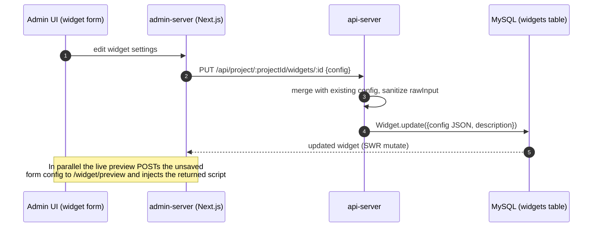
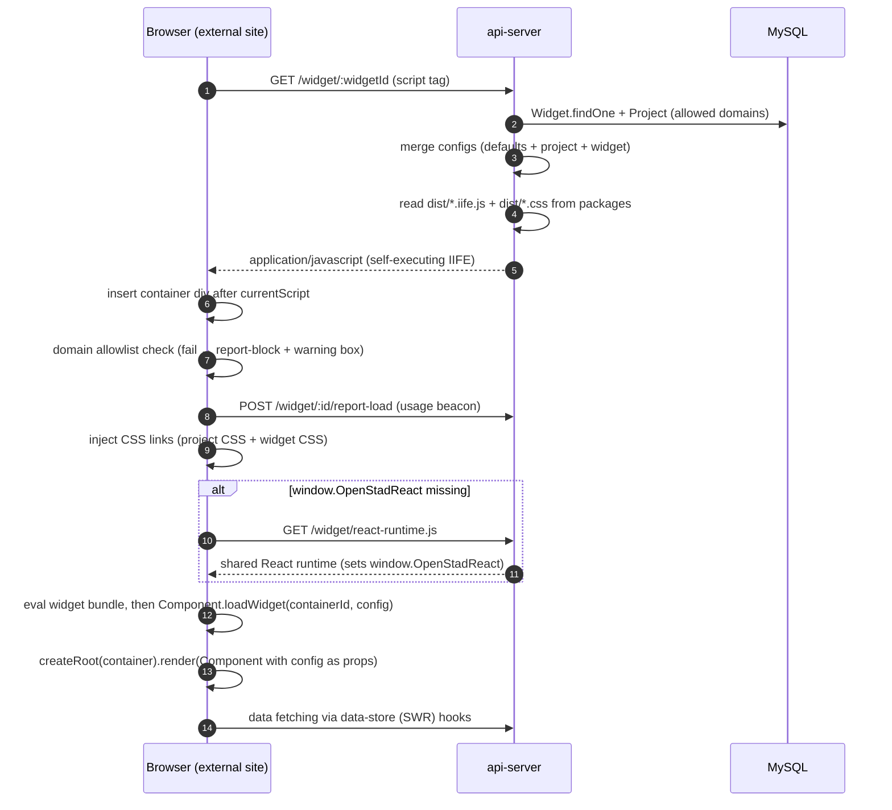

# Widget system

OpenStad widgets are React components, built per package to a standalone **IIFE bundle**, that
any website can embed with a single script tag:

```html
<script src="https://<api-host>/widget/<widgetId>"></script>
```

Three parts cooperate:

1. **Package** (`packages/<widget>`) — the React frontend, built with Vite to `dist/*.iife.js` + `dist/*.css`
2. **api-server** — stores the widget config (JSON in the `widgets` table) and serves
   bundle + config as one self-executing script
3. **admin-server** — the configuration UI with live preview

## Packages overview

**Registered widget types** (`widget.type` keys in
`apps/api-server/src/routes/widget/widget-settings.js` — note they differ from package names):
`account`, `activity`, `agenda`, `basemap`, `begrootmodule` (package `stem-begroot`),
`choiceguide`, `choiceguideResults`, `comments`, `counter`, `datecountdownbar`,
`distributionmodule`, `documentmap`, `editormap`, `enquete`, `likes`,
`multiprojectresourceoverview`, `rawresource`, `resourcedetail`, `resourcedetailmap`,
`resourcedetailwithmap`, `resourceform`, `resourceoverview`, `resourcesmap`,
`resourcewithmap`, `simplevoting`, `videoSlider`. The four `*map` types are built from the
`leaflet-map` package. External plugins can add more types via `plugin-loader`.

Packages such as `form`, `navBar`, `footer`, `video`, `dilemma`, `swipe` are embedded by other
widgets or standalone/experimental — they have no registry entry of their own.

**Shared libraries:**

| Package                           | Purpose                                                                                           |
| --------------------------------- | ------------------------------------------------------------------------------------------------- |
| `data-store`                      | Data layer wrapping SWR: API fetchers + hooks (`useResource`, `useComments`, `useCurrentUser`, …) |
| `ui`                              | Shared base UI components                                                                         |
| `lib`                             | Utilities: `load-widget.tsx`, `hasRole`, notification provider, **`vite.config.factory.ts`**      |
| `types`                           | Shared TypeScript types (`BaseProps`, `ProjectSettingProps`, …)                                   |
| `plugin-loader`                   | Merges external plugin widget definitions into the core widget registry                           |
| `eslint-config-custom`, `configs` | Shared lint/tsconfig                                                                              |

`packages/apostrophe-widgets/*` are CMS content widgets for cms-server — a separate system.

## Anatomy of a widget package (example: `packages/likes`)

```
src/likes.tsx        Main component + prop types; ends with `Likes.loadWidget = loadWidget`
src/main.tsx         Dev-only entry: mock config from VITE_* env vars, renders into index.html
vite.config.ts       Thin wrapper: createWidgetConfig({ name: 'OpenstadHeadlessLikes', entry: 'src/likes.tsx' })
package.json         dev = `vite`, build = `tsc && vite build` → dist/likes.iife.js + dist/likes.css
```

`packages/lib/vite.config.factory.ts` (`createWidgetConfig`) defines the shared build:

- Output format **IIFE** with a global name per widget (e.g. `OpenstadHeadlessLikes`)
- `react`, `react-dom`, `react-dom/client` are **externalized** to the globals
  `OpenStadReact` / `OpenStadReactDOM` — React is _not_ bundled per widget
- CSS is scoped under the `.openstad` class prefix
- In dev (`vite` serve) it behaves as a normal React app via `src/main.tsx`

## Serving: no on-the-fly bundling

The api-server does **not** bundle at request time. `getWidgetJavascriptOutput()`
(`apps/api-server/src/routes/widget/widget-output.js`) reads each registered package's prebuilt
`dist/*.iife.js` / `dist/*.css` from disk via `require.resolve` and concatenates them into the
response. Consequences:

- A package must be built before its changes appear anywhere (including the admin preview).
- During development, `apps/api-server/nodemon-watch-server.js` watches the whole repo, maps
  changed files to their package, and rebuilds that package **plus its dependents** (via
  `scripts/get-headless-dependency-tree`).

The shared React runtime (`window.OpenStadReact`) is a separate esbuild bundle
(`apps/api-server/scripts/build-react-runtime.js` → `dist/openstad-react-runtime.js`) served at
`GET /widget/react-runtime.js` and loaded once per page (`src/util/react-check.js`).

## Flow 1: configuration → storage



Key files: `apps/admin-server/src/hooks/use-widget-config.tsx` (save),
`apps/admin-server/src/hooks/useWidgetPreview.tsx` + `src/components/widget-preview.tsx`
(preview), `apps/api-server/src/routes/api/widget.js` (CRUD),
`apps/api-server/src/models/Widget.js` (model). The preview endpoint
(`POST /widget/preview` in `routes/widget/widget.js`) runs the same output pipeline with
`isPreview=true` (no domain check, no load beacon), taking config from the request body instead
of the database.

## Flow 2: embed → serve → render



Key files: `apps/api-server/src/routes/widget/widget.js` (GET route, config merge),
`widget-settings.js` (registry: `{packageName, js, css, functionName, componentName,
defaultConfig}` per type, plus plugin-loader merge), `widget-output.js` (IIFE assembly),
`src/util/react-check.js` (runtime bootstrap), `packages/lib/load-widget.tsx` (final render).

## data-store gotchas

- `packages/data-store/package.json` declares `"main": "index.jt"` (typo) — **always import
  `@openstad-headless/data-store/src`** like the existing widgets do.
- It wraps SWR with a global registry (`window.OpenStadSWR`) so widgets on the same page share
  cache invalidation (`datastore.refresh()` revalidates everything). This can cause unexpected
  re-renders across widgets.
- Optimistic updates go through `mutate(...)` with `merge-data.js`; replies with a `parentId`
  force a full revalidate (SWR can't merge nested reply structures).

## Adding or changing a widget

1. Frontend in `packages/<widget>/src/`; dev with mock config in `src/main.tsx` + `npm run dev`
   (api-server must be running for data).
2. Register new widget types in `apps/api-server/src/routes/widget/widget-settings.js`
   (`packageName`, `js`/`css` dist paths, `functionName`, `componentName`, `defaultConfig`).
3. Config UI in `apps/admin-server/src/pages/projects/[project]/widgets/<type>/`.
4. `npm run build` in the package before checking the admin preview.
5. Component tests (Cypress) in `packages/<widget>/cypress/component/` are strongly
   recommended; unit tests with Vitest for logic.
