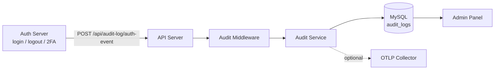

## Audit Logging

OpenStad records CRUD mutations, admin reads, and authentication events for compliance. Events are stored in MySQL and optionally forwarded via OTLP to an external log backend (Loki, Elasticsearch, etc).

### How it works



- The **API server** runs an Express middleware that logs every write (POST/PUT/DELETE) and every admin/editor/moderator GET.
- The **auth server** forwards login, logout, register, password reset, and 2FA events to the API server using a shared internal token.
- The **audit service** writes to the `audit_logs` table and, when enabled, exports each event as an OpenTelemetry LogRecord over gRPC.
- Records are immutable. Only changed fields are stored for updates; passwords and tokens are never logged.
- A daily cron job (`cleanup_audit_logs`) deletes expired records in batches.

The `action` field stores the HTTP method (`GET`, `POST`, `PUT`, `DELETE`) for API events, or the event name (`login`, `logout`, `2fa_failed`, …) for auth events. The `modelName` is derived from the URL path.

### Retention

- **Default**: 12 months (`AUDIT_RETENTION_MONTHS`)
- **Security incident**: 36 months for the affected project (`AUDIT_INCIDENT_RETENTION_MONTHS`). A superuser activates this from the project settings page in the admin panel.

## Configuration

### Helm values

```yaml
api:
  audit:
    retentionMonths: 12
    incidentRetentionMonths: 36
    internalToken: 'generate-a-strong-token' # shared with auth server
    otlp:
      enabled: false
      endpoint: '' # defaults to api.otelExporterOtlpEndpoint
      headers: ''

auth:
  audit:
    apiEndpoint: 'http://openstad-api-server/api/audit-log/auth-event'
    apiToken: 'generate-a-strong-token' # must match api.audit.internalToken
```

Store `internalToken` / `apiToken` as a SOPS-encrypted secret (see [deployment.md](deployment.md)). The same value must be set on both servers.

### Enabling OTLP export

Set `api.audit.otlp.enabled: true` and point `endpoint` at an OpenTelemetry Collector. The collector can route audit logs to any supported backend:

```yaml
# otel-collector config — route audit logs to Loki
exporters:
  loki:
    endpoint: http://loki:3100/loki/api/v1/push

service:
  pipelines:
    logs:
      receivers: [otlp]
      exporters: [loki]
```

Audit events carry `service.namespace=audit` and `audit.*` attributes (action, model, user_id, project_id, ip_address, route_path, status_code) so they can be filtered from other logs in the collector pipeline.

## Admin panel

- **Audit log tab** on resource and user detail pages — shows a chronological list of events with changed fields, user, role, IP, and status code.
- **Report security incident** button on project settings (superuser only) — extends retention to 36 months for that project.

## API

| Endpoint                                            | Auth            | Purpose                        |
| --------------------------------------------------- | --------------- | ------------------------------ |
| `GET /api/project/:projectId/audit-log`             | admin+          | Query audit logs for a project |
| `GET /api/audit-log`                                | admin+          | Query audit logs (global)      |
| `POST /api/audit-log/auth-event`                    | `X-Audit-Token` | Internal — used by auth server |
| `PUT /api/project/:projectId/audit-log/incident`    | superuser       | Activate incident retention    |
| `DELETE /api/project/:projectId/audit-log/incident` | superuser       | Deactivate incident retention  |

Query endpoints support filtering by `modelName`, `modelId`, `userId`, `action`, `source`, `fromDate`, `toDate`, and standard `page` / `pageSize` pagination.
