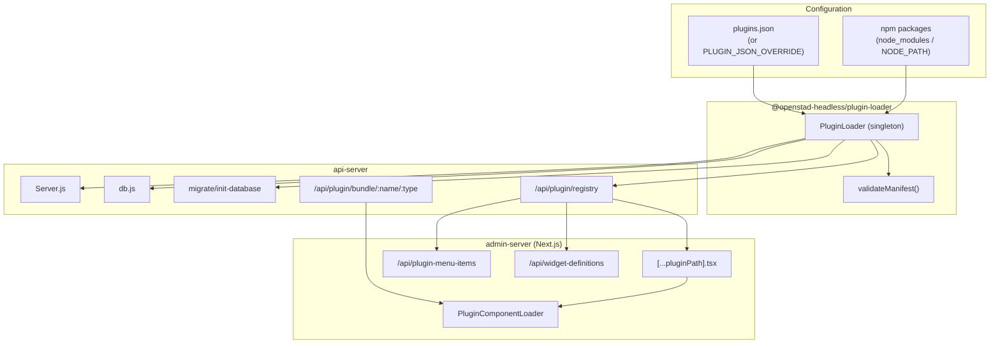

# OpenStad Headless — Plugin System

Technical documentation of the manifest-driven plugin architecture of OpenStad
Headless: the `@openstad-headless/plugin-loader` package, its integration into
the api-server and admin-server, and configuration via Helm and Docker Compose.

> The code examples below use a hypothetical package `@myorg/example-plugin` —
> an admin-SSO plugin (OIDC / Azure Entra ID) — as an illustrative example. It is
> not a real, published package; substitute your own package name and paths.

---

## Contents

1. [Overview](#1-overview)
2. [Architecture](#2-architecture)
3. [The plugin manifest](#3-the-plugin-manifest)
4. [Manifest validation](#4-manifest-validation)
5. [The PluginLoader](#5-the-pluginloader)
6. [`plugins.json`](#6-pluginsjson)
7. [Integration in the api-server](#7-integration-in-the-api-server)
8. [Integration in the admin-server](#8-integration-in-the-admin-server)
9. [HTTP endpoints](#9-http-endpoints)
10. [Configuration: Kubernetes / Helm](#10-configuration-kubernetes--helm)
11. [Configuration: Docker Compose / local](#11-configuration-docker-compose--local)
12. [Example plugin: an admin-SSO plugin](#12-example-plugin-an-admin-sso-plugin)
13. [Building a plugin — step by step](#13-building-a-plugin--step-by-step)
14. [Publishing & versioning](#14-publishing--versioning)
15. [Security considerations](#15-security-considerations)
16. [Troubleshooting](#16-troubleshooting)

---

## 1. Overview

The plugin system lets you add functionality to OpenStad **without forking the
core**. A plugin is a regular npm package that exports a **manifest**. The core
reads that manifest and hooks the plugin's parts into predefined extension
points: API routes, Express middleware, Sequelize models, database migrations,
admin pages, sidebar menu items, widgets, and CMS hooks.

Design principles:

- **Manifest-driven** — a plugin declaratively describes _what_ it provides; the
  loader decides _how_ it gets wired in.
- **Fail-safe** — a broken or missing plugin logs an error but never crashes the
  server. Every load step is wrapped in a `try/catch`.
- **Runtime installation** — in Kubernetes, plugins are fetched at startup via an
  init container running `npm install`; no custom image build is required.
- **No per-plugin core changes** — adding a plugin is a configuration change
  (`plugins.json` or Helm `values`), not a code change.

In line with the [deployment model](./deployment.md), each municipality runs its
own installation (its own Kubernetes namespace); plugins are configured per
installation.

---

## 2. Architecture



The **PluginLoader** is a singleton (`PluginLoader.getInstance()`) called from
several places in the api-server. Each caller invokes `load()`; thanks to the
`_loaded` guard, the loader reads `plugins.json` only once per process.

Consumers of the loader in the api-server:

| Location                                                  | Uses                        | Purpose                     |
| --------------------------------------------------------- | --------------------------- | --------------------------- |
| `Server.js`                                               | `initPluginLoader()`        | Wire in middleware + routes |
| `db.js`                                                   | `getApiHooks()`             | Register Sequelize models   |
| `scripts/migrate-database.js`, `scripts/init-database.js` | `getPluginMigrationGlobs()` | Include plugin migrations   |
| `routes/plugin/index.js`                                  | `getLoadedPlugins()`        | Serve registry & bundles    |
| `routes/widget/widget-settings.js`                        | `getWidgetDefinitions()`    | Merge plugin widgets        |

The **admin-server** does not talk to the loader directly; it fetches all plugin
metadata through the HTTP endpoint `/api/plugin/registry` on the api-server.

---

## 3. The plugin manifest

A plugin is an npm package whose `main` exports a manifest object. Two shapes are
accepted (see `_loadEntries` in the loader):

```js
// Shape A — module.exports IS the manifest
module.exports = { name: 'sso', version: '1.0.0', api: {/* ... */} };

// Shape B — module.exports.manifest is the manifest
module.exports.manifest = { name: 'sso', version: '1.0.0', api: {/* ... */} };
```

The loader takes `pluginModule.manifest || pluginModule`.

### TypeScript interface

The full shape (from `packages/plugin-loader/src/index.ts`):

```ts
interface PluginManifest {
  name: string; // required
  version: string; // required
  packageName?: string;
  config?: Record<string, unknown>;
  api?: PluginApiSection;
  admin?: PluginAdminSection;
  widgets?: Record<string, PluginWidgetDefinition>;
  cms?: Record<string, unknown>;
}

interface PluginApiSection {
  models?: Array<{ name: string; path: string }>;
  routes?: Array<{ method: string; path: string; handler: string }>;
  middleware?: Array<{ path: string; position?: string; priority?: number }>;
  migrations?: { directory: string };
  envVars?: string[];
}

interface PluginAdminSection {
  bundle?: { js: string; css?: string };
  pages?: Array<{ path: string; componentName: string; label?: string }>;
  menuItems?: Array<{ label: string; href: string; role?: string }>;
}

interface PluginWidgetDefinition {
  packageName: string;
  directory: string;
  js: string | string[];
  css: string | string[];
  functionName: string;
  componentName: string;
  defaultConfig: Record<string, unknown>;
  name?: string;
  description?: string;
  image?: string;
  adminBundle?: { js: string; componentName: string };
}
```

### Top-level fields

| Field         | Required | Description                                                                     |
| ------------- | -------- | ------------------------------------------------------------------------------- |
| `name`        | ✅       | Unique, short identifier (e.g. `sso`). Used in logs, registry, and bundle URLs. |
| `version`     | ✅       | Semver string. Usually `require('./package.json').version`.                     |
| `packageName` | —        | Informational; the effective package name comes from `plugins.json`.            |
| `config`      | —        | Default config, merged into widget `defaultConfig` (see §7).                    |
| `api`         | —        | Backend hooks: models, routes, middleware, migrations, env vars.                |
| `admin`       | —        | Admin UI: bundle, pages, menu items.                                            |
| `widgets`     | —        | Front-end widgets (same shape as core widgets).                                 |
| `cms`         | —        | CMS hooks (retrieved via `getCmsHooks()`).                                      |

### `api` section

- **`models`** — `[{ name, path }]`. `path` is relative to the package root. The
  file exports a Sequelize model factory `(db, sequelize, DataTypes) => model`.
- **`routes`** — `[{ method, path, handler }]`. `method` is an Express method
  (`get`, `post`, `use`, …), `path` a route path, `handler` a path to a handler
  module. **Factory convention:** if the module exports a `createHandler(context)`
  function, it is called with `{ config, pluginName }` and the returned function
  is the handler. Otherwise the module export is used directly as an Express
  handler.
- **`middleware`** — `[{ path, position?, priority? }]`. See
  [middleware positions](#middleware-positions).
- **`migrations`** — `{ directory }`. Converted to a glob
  `<packageDir>/<directory>/*.js` and passed to Umzug.
- **`envVars`** — `string[]`. When loading, the loader warns (not an error) if an
  expected env var is missing.

#### Middleware positions

Middleware is grouped by `position` and, within a group, sorted by `priority`
(lower = earlier; default `100`). `Server.js` applies the groups at fixed points
in the request pipeline:

| `position`       | Applied after / around                     |
| ---------------- | ------------------------------------------ |
| `before:statics` | before serving static files                |
| `after:basic`    | after basic middleware (body parser, etc.) |
| `after:session`  | after session middleware                   |
| `before:routes`  | just before the core routes (**default**)  |
| `after:routes`   | after all core and plugin routes           |

Unknown positions are ignored (there is no bucket for them).

### `admin` section

- **`bundle`** — `{ js, css? }`. Path (relative to package root) to a prebuilt
  IIFE bundle for admin pages, served via `/api/plugin/bundle/:name/admin`.
- **`pages`** — `[{ path, componentName, label? }]`. Each page becomes reachable
  in the admin at `/<path>` via the catch-all route. `componentName` is the name
  exposed on the `window.OpenStadPlugin_<name>` object.
- **`menuItems`** — `[{ label, href, role? }]`. Sidebar items. `role` optionally
  restricts visibility.

### `widgets` section

An object `{ widgetKey: PluginWidgetDefinition }`. The shape is identical to core
widgets, plus an optional `adminBundle` for the config-form component loaded in
the admin via `/api/plugin/bundle/:name/widget-admin`.

### `cms` section

A free-form object, retrieved via `getCmsHooks()`. Its structure is not
validated; the meaning depends on the CMS integration consuming the hooks.

---

## 4. Manifest validation

`validateManifest()` (`packages/plugin-loader/src/validate.ts`) runs for every
plugin being loaded. If validation fails, the plugin is **skipped** (logged, no
crash). Checks:

**Top-level**

- `name` — non-empty string.
- `version` — non-empty string.

**`api`**

- `models[i]` — `name` and `path` required.
- `routes[i]` — `method`, `path`, and `handler` required.
- `middleware[i]` — `path` required.

**`widgets["key"]`** — required fields:
`packageName`, `directory`, `js`, `css`, `functionName`, `componentName`,
`defaultConfig`.

**`admin`**

- `pages[i]` — `path` required, plus `componentName` **or** `componentPath`.
- `menuItems[i]` — `label` and `href` required.

All errors are collected and reported together (validation does not stop at the
first error).

---

## 5. The PluginLoader

Source: `packages/plugin-loader/src/index.ts`.

### Source resolution order

`load(pluginsJsonPath?)` determines, in this order, where the plugin
configuration comes from:

1. **`PLUGIN_JSON_OVERRIDE`** (env) — inline JSON string. Used in Kubernetes
   (populated from a ConfigMap). Always takes precedence.
2. **Argument** `pluginsJsonPath`.
3. **`OPENSTAD_PLUGINS_PATH`** (env).
4. **Searching upward** from `__dirname` for a `plugins.json`; otherwise the
   fallback `../../plugins.json`.

> **Security:** regardless of how the path is derived, the loader refuses to read
> a file that is not literally named `plugins.json` (`throw`). This prevents an
> unexpected path from turning into an arbitrary file read.

### Singleton & idempotency

- `getInstance()` returns the shared instance.
- `load()` is idempotent via the `_loaded` flag: multiple callers (Server.js,
  db.js, routes) therefore share a single loaded set of plugins.
- `reset()` — for tests only.
- `reload(path?)` — clears the state and reloads. **Note:** this only refreshes
  registry metadata (pages, menu items, widget admin). API hooks (models, routes,
  middleware) are wired in at startup and cannot be hot-reloaded.

### Public API

| Method                           | Returns                                    |
| -------------------------------- | ------------------------------------------ |
| `load(path?)`                    | `void` — loads & validates enabled plugins |
| `reload(path?)`                  | `void` — reloads registry metadata         |
| `getApiHooks()`                  | plugins with an `api` section              |
| `getAdminHooks()`                | plugins with an `admin` section            |
| `getWidgetDefinitions()`         | merged widgets (first-wins on conflict)    |
| `getCmsHooks()`                  | plugins with a `cms` section               |
| `getLoadedPlugins()`             | all loaded plugins                         |
| `getPluginMigrationGlobs(base?)` | migration globs incl. core                 |

### Config merge for widgets

In `getWidgetDefinitions()`, the plugin `config` is merged as **defaults** into
the widget `defaultConfig` (`{ ...plugin.config, ...definition.defaultConfig }`);
explicit widget defaults win. This makes values from `plugins.json` (e.g.
`adminUrl`) available as defaults when the widget renders.

On a duplicate `widgetKey` across multiple plugins, the first wins; the rest are
skipped with a warning.

---

## 6. `plugins.json`

The configuration file (or the inline `PLUGIN_JSON_OVERRIDE` JSON) has the shape:

```json
{
  "plugins": [
    {
      "name": "example",
      "packageName": "@myorg/example-plugin",
      "version": "1.0.0",
      "enabled": true,
      "config": {
        "adminUrl": "https://admin.example.org"
      }
    }
  ]
}
```

| Field                        | Description                                                                                        |
| ---------------------------- | -------------------------------------------------------------------------------------------------- |
| `name`                       | Informational label.                                                                               |
| `packageName` (or `package`) | npm package name the loader `require()`s. Both keys work.                                          |
| `version`                    | Only relevant for the Helm init container (`npm install pkg@version`). The loader does not use it. |
| `enabled`                    | Only entries with `enabled: true` are loaded.                                                      |
| `config`                     | Config passed to the plugin (routes context + widget defaults).                                    |

Only `enabled: true` entries are processed (`_loadEntries`).

---

## 7. Integration in the api-server

### Middleware & routes (`Server.js`)

At startup (`src/Server.js`, around line 64):

```js
const {
  initPluginLoader,
  createMiddlewareApplier,
} = require('./services/plugin-loader-init');
const { pluginMiddleware, pluginRoutes } = initPluginLoader();
const applyPluginMiddleware = createMiddlewareApplier(
  this.app,
  pluginMiddleware
);

applyPluginMiddleware('before:statics');
this._initStatics();
this._initBasicMiddleware();
applyPluginMiddleware('after:basic');
this._initSessionMiddleware();
applyPluginMiddleware('after:session');
applyPluginMiddleware('before:routes');
// ... core middleware & core routes ...
this.app.use('/api/plugin', require('./routes/plugin')); // registry & bundles
// ... apply plugin routes ...
applyPluginMiddleware('after:routes');
```

`initPluginLoader()` (`services/plugin-loader-init.js`):

- Calls `getApiHooks()`.
- Resolves each plugin via `require.resolve(packageName)` and loads middleware/
  handler files relative to the package dir.
- Groups middleware by position and sorts by `priority`.
- Builds `pluginRoutes` using the factory convention (`createHandler(context)` or
  direct export).

Every step is wrapped in `try/catch`; a `MODULE_NOT_FOUND` (no plugins installed)
is silently ignored.

### Models (`db.js`)

`db.js` (around line 134) iterates over `getApiHooks()`, loads the model factory
for each `api.models[]` entry relative to the package dir, and registers the
model on the shared `db` object. Per-model errors are logged and skipped.

### Migrations (`scripts/migrate-database.js`, `scripts/init-database.js`)

`getPluginMigrationGlobs()` adds a glob per plugin that has
`api.migrations.directory` to the core glob (`./migrations/*.js`), resolved as
`<packageDir>/<directory>/*.js`. The migration scripts pass these globs to Umzug
so plugin migrations run alongside core migrations.

> In Kubernetes, the DB migration runs in a **separate init container** that
> receives the same plugin env and the shared plugin volume (see §10), so
> `require.resolve` can find the plugin.

### Widgets (`routes/widget/widget-settings.js`)

Around line 691, `getWidgetDefinitions()` widgets are merged with the core
widgets. If a plugin widget collides with a core widget key, the core wins and
the plugin widget is skipped with a warning.

---

## 8. Integration in the admin-server

The admin-server (Next.js) has no advance knowledge of plugins; everything comes
through the api-server registry. The admin fetches it with a server-side `fetch`
to `API_URL_INTERNAL` (or `API_URL`).

### Registry consumers

| Admin route                       | Source                           | Purpose              |
| --------------------------------- | -------------------------------- | -------------------- |
| `pages/api/plugin-menu-items.ts`  | `registry.menuItems`             | Sidebar items        |
| `pages/api/widget-definitions.ts` | `registry.widgetAdminComponents` | Widget config forms  |
| `pages/[...pluginPath].tsx`       | `registry.pages`                 | Dynamic plugin pages |

### Dynamic plugin pages

`pages/[...pluginPath].tsx` is a catch-all. `getServerSideProps` matches the
requested path against `registry.pages`; on a match, the page is rendered with
`PluginComponentLoader`. No match → `notFound`.

### The IIFE bundle contract (`PluginComponentLoader`)

`components/plugin-component-loader.tsx` loads a plugin bundle client-side:

1. Sets props on `window.__openstad_plugin_props[pluginName]`.
2. Injects a `<script src="/api/plugin/bundle/<name>/<type>?v=<cachebuster>">`.
3. After `onload` it reads `window.OpenStadPlugin_<name>` and expects:
   - **Preferred:** a `mount(container, props)` (and optionally
     `unmount(container)`). The plugin then renders with its **own** React
     version — this avoids version conflicts with the host.
   - **Fallback:** a component under `componentName`, rendered via the host React
     (`react-dom/client`). Only safe when the React version matches.
4. On unmount it cleans up: script removed, `unmount()` called, globals detached.

> **Recommendation:** always export `mount`/`unmount` and bundle your own React
> in the IIFE. The fallback exists for simple cases but is version-sensitive.

The bundle must therefore set a global `window.OpenStadPlugin_<name>` with at
least `mount` (or `componentName`). `bundleType` is `admin` (from
`admin.bundle.js`) or `widget-admin` (from `widgets[key].adminBundle.js`).

---

## 9. HTTP endpoints

All under `/api/plugin` (`apps/api-server/src/routes/plugin/index.js`).

### `GET /api/plugin/registry`

Returns the admin metadata of all loaded plugins:

```json
{
  "pages": [
    {
      "path": "sso-settings",
      "componentName": "SsoSettings",
      "pluginName": "sso",
      "label": "SSO"
    }
  ],
  "menuItems": [{ "label": "SSO", "href": "/sso-settings", "role": "admin" }],
  "widgetAdminComponents": {
    "myWidget": {
      "pluginName": "sso",
      "componentName": "MyWidgetForm",
      "name": "My Widget",
      "description": "...",
      "image": ""
    }
  }
}
```

Page labels are derived from a matching menu item (`href === '/' + page.path`) or
otherwise from the plugin name (capitalized).

### `POST /api/plugin/reload`

Reloads the registry metadata without restarting the server. **Requires**
`API_FIXED_AUTH_KEY` via the `x-authorization` / `authorization` header or the
`authKey` query param. Without a valid key: `401`.

```bash
curl -X POST https://<API_URL>/api/plugin/reload \
  -H "x-authorization: $API_FIXED_AUTH_KEY"
```

Response: `{ success, pluginsLoaded, plugins: [name, …] }`.

> Reloads **only** registry metadata. New models/routes/middleware require an
> api-server restart.

### `GET /api/plugin/bundle/:pluginName/:bundleType`

Serves a prebuilt IIFE bundle. `bundleType` ∈ `admin` | `widget-admin` (otherwise
`400`). For `widget-admin`, `?widget=<key>` selects the widget; without a key the
first widget with an `adminBundle` is used.

Security:

- The path is resolved within the package root and normalized with
  `path.normalize`; if it falls outside the root → `400` (path-traversal
  protection).
- If the file does not exist: `404`.
- Headers: `Content-Type: application/javascript`, `Cache-Control: no-cache`,
  `X-Plugin-Name: <name>`. Served via `res.sendFile` (streamed).

---

## 10. Configuration: Kubernetes / Helm

Chart: `charts/openstad-headless`. Plugins are installed **at runtime** via an
init container — no custom image required.

### `values.yaml`

```yaml
plugins:
  enabled: false
  # Node.js image for the init container (npm install)
  nodeImage: node:24-slim
  # Install path in the shared volume
  installPath: /opt/openstad-plugins
  # Optional: name of an existing Secret holding a .npmrc (private registries).
  # The secret must have a ".npmrc" key.
  npmrcSecret: ''
  # Plugin list (same format as plugins.json)
  items: []
  # Example:
  # items:
  #   - name: my-plugin
  #     packageName: "@myorg/my-plugin"
  #     version: "1.2.3"
  #     enabled: true
  #     config:
  #       someKey: someValue
```

### What the chart generates (when `plugins.enabled: true`)

**1. ConfigMap** (`templates/plugins-configmap.yaml`) — `plugins.items` is
serialized to JSON under the key `plugins.json`:

```yaml
data:
  plugins.json: |
    {{ dict "plugins" .Values.plugins.items | toJson }}
```

**2. Init container `install-plugins`** (`templates/api/deployment.yaml`) — runs
before the api container and installs the enabled packages into the shared
volume:

```sh
cd /opt/openstad-plugins
echo '{"private":true}' > package.json
# if npmrcSecret: cp /etc/npmrc-secret/.npmrc .npmrc
npm install --no-save <pkg>@<version> ...   # only enabled items
```

Hardened security context: `readOnlyRootFilesystem: true`,
`allowPrivilegeEscalation: false`, all capabilities dropped,
`seccompProfile: RuntimeDefault`. `HOME`/`npm_config_cache` point to the `/tmp`
emptyDir so npm can write despite the read-only rootfs.

**3. Shared volume `plugin-modules`** (emptyDir) — mounted at `installPath` in
both the init container and the api container.

**4. Env vars on the api container AND the DB migration init container:**

```yaml
- name: NODE_PATH
  value: '/opt/openstad-plugins/node_modules'
- name: PLUGIN_JSON_OVERRIDE
  valueFrom:
    configMapKeyRef:
      name: <release>-plugins
      key: plugins.json
```

`NODE_PATH` lets Node find plugins installed in the volume; `PLUGIN_JSON_OVERRIDE`
gives the loader the config inline (precedence 1 in §5). The DB migration init
container gets the same env + volume mount so plugin migrations are found during
`migrate-database`.

### Private registries (GitHub Packages, etc.)

Create a Secret with a `.npmrc` and reference it via `plugins.npmrcSecret`:

```bash
kubectl create secret generic plugin-npmrc \
  --from-file=.npmrc=./.npmrc -n <namespace>
```

```yaml
plugins:
  enabled: true
  npmrcSecret: plugin-npmrc
  items:
    - name: example
      packageName: '@myorg/example-plugin'
      version: '1.0.0'
      enabled: true
```

The `.npmrc` is mounted read-only at `/etc/npmrc-secret` and copied to
`installPath/.npmrc` before `npm install`.

> For a plugin published to a private registry (e.g. GitHub Packages), a `.npmrc`
> with a read token for that registry is required.

### Plugin env variables

Plugin env (e.g. `AZURE_*` for an SSO plugin) is **not** part of the plugin
system. Set it via `api.extraEnvVars` in the chart or via the corresponding
secrets, like any other api-server env.

---

## 11. Configuration: Docker Compose / local

The bundled `docker-compose*.yml` files contain **no** plugin configuration; the
runtime-install mechanism is Kubernetes-specific. Locally you load plugins via a
`plugins.json` that the loader finds (§5):

**Option A — `plugins.json` in the api-server root:**

```jsonc
// apps/api-server/plugins.json
{
  "plugins": [
    {
      "name": "example",
      "packageName": "@myorg/example-plugin",
      "enabled": true,
    },
  ],
}
```

Install the package in the workspace (`npm install @myorg/example-plugin
-w apps/api-server`) or link it locally (`npm link`).

**Option B — explicit path or override via env:**

```bash
export OPENSTAD_PLUGINS_PATH=/path/to/plugins.json
# or inline (like K8s):
export PLUGIN_JSON_OVERRIDE='{"plugins":[{"name":"example","packageName":"@myorg/example-plugin","enabled":true}]}'
```

Set plugin env variables (e.g. `AZURE_*`) in the api-server's `.env`.

---

## 12. Example plugin: an admin-SSO plugin

This section walks through a realistic example: an admin-SSO plugin that adds
OIDC login (e.g. Azure Entra ID) alongside the existing e-mail login. It is a
worked example, not a shipped package — use it as a template. A typical layout:

```
example-plugin/
├── index.js                         # manifest (module.exports = { ... })
├── package.json                     # publishConfig → private registry
├── api/
│   ├── adapters/oidc/               # OIDC adapter (openid-client, PKCE)
│   │   ├── index.js  router.js  service.js  flow-cookie.js  safe-redirect.js
│   └── middleware/force-oidc-useauth.js
├── scripts/register-oidc-provider.js
├── test/                            # vitest
└── .env.example
```

### The manifest (`index.js`)

```js
const { version } = require('./package.json');

module.exports = {
  name: 'sso',
  version,
  api: {
    middleware: [
      {
        path: 'api/middleware/force-oidc-useauth.js',
        position: 'before:routes',
        priority: 50,
      },
    ],
    envVars: [
      'AZURE_TENANT_ID',
      'AZURE_CLIENT_ID',
      'AZURE_CLIENT_SECRET',
      'AZURE_REDIRECT_URI',
      'AZURE_ROLE_MAPPING',
      'AZURE_ADMIN_PROJECT_ID',
    ],
  },
  setup: async (config) => {
    /* ... */
  },
};
```

Takeaways from this pattern:

- **Minimal manifest.** The plugin registers just one `before:routes` middleware
  (priority `50`, i.e. before the default `100`) plus the required `envVars`. The
  heavy logic (the OIDC adapter) lives in `api/adapters/`.
- **Not everything goes through the manifest.** The auth adapter can be loaded by
  the api-server via `config.auth.adapter.<name>.modulePath`, which a **separate
  registration script** (`scripts/register-oidc-provider.js`) writes into the
  project config. So the manifest can cooperate with existing core mechanisms
  outside the plugin hooks.
- **Package `files` whitelist** (`index.js`, `api/`, `scripts/`, `.env.example`)
  keeps the published package small.
- **`peerDependencies: express`** — the plugin shares the host's Express instance
  instead of bundling its own version.
- **`publishConfig.registry`** can point to a private registry (see §14).

### Installing such a plugin (summary)

1. Add it to `plugins.json` / Helm `plugins.items` with `enabled: true`.
2. Set the plugin's env variables (e.g. `AZURE_*`) on the api-server.
3. If the plugin uses a registration script (as above), run it from the
   **api-server root** to set the provider on the admin project (in K8s with a
   `NODE_PATH` that includes both the api deps and the plugin).
4. Restart the api-server.

---

## 13. Building a plugin — step by step

1. **New npm package.** `package.json` with `name`, `version`, `main`. Put
   `express` in `peerDependencies` (the plugin shares the host's Express
   instance). For admin/widget bundles, put `react`/`react-dom` in regular
   `dependencies` — they are bundled into the IIFE (see §8), just like the core
   widget packages do (e.g. `packages/dilemma`). Restrict the package with
   `files`.

2. **Export the manifest** from `main`:

   ```js
   const { version } = require('./package.json');
   module.exports = {
     name: 'my-plugin',
     version,
     api: {
       routes: [
         {
           method: 'get',
           path: '/api/my-plugin/status',
           handler: 'api/status.js',
         },
       ],
       middleware: [
         { path: 'api/mw.js', position: 'before:routes', priority: 100 },
       ],
       models: [{ name: 'MyModel', path: 'api/models/my-model.js' }],
       migrations: { directory: 'migrations' },
       envVars: ['MY_PLUGIN_API_KEY'],
     },
     admin: {
       bundle: { js: 'dist/admin.iife.js' },
       pages: [
         {
           path: 'my-plugin',
           componentName: 'MyPluginPage',
           label: 'My Plugin',
         },
       ],
       menuItems: [{ label: 'My Plugin', href: '/my-plugin' }],
     },
   };
   ```

3. **Route handlers** — use the factory convention if you need the plugin config:

   ```js
   // api/status.js
   module.exports.createHandler =
     ({ config, pluginName }) =>
     (req, res) => {
       res.json({ plugin: pluginName, adminUrl: config.adminUrl });
     };
   ```

4. **Models** — export a Sequelize factory `(db, sequelize, DataTypes) => model`.

5. **Migrations** — put Umzug migrations in `migrations/` and reference them via
   `api.migrations.directory`.

6. **Admin bundle** — build an IIFE that sets `window.OpenStadPlugin_<name>` with
   a `mount(container, props)` (recommended) and `unmount(container)`. Bundle your
   own React to avoid version conflicts.

7. **Validate locally** — add the plugin to `plugins.json`, start the api-server,
   and check the `[plugin-loader]` log lines and `GET /api/plugin/registry`.

8. **Tests** — `vitest` works well here. Test at least the manifest shape and
   your handlers/middleware.

---

## 14. Publishing & versioning

- **Registry.** A plugin can publish to a public or private registry. For a
  private registry (e.g. GitHub Packages,
  `publishConfig.registry: https://npm.pkg.github.com`), consumers need a
  `.npmrc` with a read token; in K8s via `plugins.npmrcSecret` (§10).
- **Version in `plugins.json` / `items`.** The `version` determines what the Helm
  init container installs (`npm install pkg@version`). Pin a concrete version for
  reproducible deploys.
- **Manifest `version`** usually comes from `package.json` and is purely
  informational to the loader/logs.
- **CI.** A `.github/workflows/ci.yml` (tests) plus a `publish.yml` (publishing)
  is a good pattern: test on PR, publish on tag/release.

---

## 15. Security considerations

- **`plugins.json` guard.** The loader never reads a file not named
  `plugins.json` — preventing arbitrary file reads via a manipulated path.
- **Path traversal for bundles.** Bundle paths are resolved within the package
  root and normalized; outside the root → `400`.
- **Auth on `/reload`.** Requires `API_FIXED_AUTH_KEY`.
- **Fail-safe loading.** Broken plugins, missing modules, or invalid manifests
  are logged and skipped; the server keeps running.
- **Trust only trusted plugins.** A plugin runs with **full privileges** inside
  the api-server process (its own middleware, routes, DB models, migrations).
  Only install packages you trust and pin versions.
- **Env secrets.** Plugin secrets (e.g. `AZURE_CLIENT_SECRET`) belong in
  Kubernetes secrets / env, never in `plugins.json` or the manifest.
- **React version isolation.** Use the `mount`/`unmount` pattern with your own
  bundled React in admin bundles; the host-React fallback is version-sensitive.
- **Init container is hardened** (`readOnlyRootFilesystem`, dropped capabilities,
  `seccompProfile: RuntimeDefault`).

---

## 16. Troubleshooting

| Symptom                                             | Likely cause                                       | Action                                                                                                                      |
| --------------------------------------------------- | -------------------------------------------------- | --------------------------------------------------------------------------------------------------------------------------- |
| `Failed to load plugin "<pkg>"` in the logs         | Package not installed or wrong `NODE_PATH`         | Check the init container logs and `NODE_PATH`; verify `plugins.items[].packageName`.                                        |
| `Invalid manifest for "<pkg>"`                      | Manifest missing required fields                   | Compare with §3/§4; fix the manifest and republish.                                                                         |
| Plugin not in `/api/plugin/registry`                | `enabled: false` or load error                     | Set `enabled: true`; check `[plugin-loader]` logs.                                                                          |
| Env var warning at startup                          | `api.envVars` expects an env that is not set       | Set the env; this is a warning, not an error.                                                                               |
| Admin page 404                                      | Path matches no `registry.pages[].path`            | Check `admin.pages[].path` and that the api-server is reachable (`API_URL_INTERNAL`).                                       |
| `window.OpenStadPlugin_<name> not found`            | Bundle does not set the global                     | Ensure the IIFE exports `window.OpenStadPlugin_<name>` with `mount`/`componentName`.                                        |
| New route/model does not work after `/reload`       | `reload` only refreshes registry metadata          | Restart the api-server.                                                                                                     |
| Plugin DB migration does not run                    | Migration init container missing plugin volume/env | Verify `plugins.enabled: true` sets both the volume and `PLUGIN_JSON_OVERRIDE`/`NODE_PATH` on the migration init container. |
| `npm install` fails in the init container (403/401) | Private registry without `.npmrc`                  | Set `plugins.npmrcSecret` with a valid token.                                                                               |
| Widget does not appear                              | Key conflict with core or another plugin widget    | Choose a unique `widgetKey`; check the conflict warning in the logs.                                                        |

---

## Sources (code)

- `packages/plugin-loader/src/index.ts` — PluginLoader, migration globs.
- `packages/plugin-loader/src/validate.ts` — manifest validation.
- `apps/api-server/src/services/plugin-loader-init.js` — wiring middleware/routes.
- `apps/api-server/src/routes/plugin/index.js` — registry, reload, bundle endpoints.
- `apps/api-server/src/Server.js` — wiring into the request pipeline.
- `apps/api-server/src/db.js` — plugin models.
- `apps/api-server/scripts/{migrate,init}-database.js` — plugin migrations.
- `apps/api-server/src/routes/widget/widget-settings.js` — plugin widgets.
- `apps/admin-server/src/components/plugin-component-loader.tsx` — IIFE loader.
- `apps/admin-server/src/pages/[...pluginPath].tsx` — dynamic pages.
- `charts/openstad-headless/templates/plugins-configmap.yaml` — ConfigMap.
- `charts/openstad-headless/templates/api/deployment.yaml` — init container, volume, env.
- `charts/openstad-headless/values.yaml` — `plugins` config.
