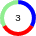

todo: icons, events en de specifieke maps

# Kaarten

Deze componenten omvatten een basiskaart, en drie typen specifieke kaarten.

De kaart is gebaseeerd op [react-leaflet](https://react-leaflet.js.org/) met [react-leaflet-cluster](https://akursat.gitbook.io/marker-cluster/).

De basiskaart, en daarmee de specifieke kaarten, kennen de volgende configuratie opties. Alles wat verder wordt meegestuurd wordt onveranderd door gestuurd naar de Leaflet MapContainer.

### project opties

De volgende opties worden op project niveau gezet en zijn in in de standaard headless opzet altijd beschikbaar:
```
area: Location[]
```
Een set van lat/lmg waarden wordt getekend als polyline, waarbij het gebied buiten de line wordt verdonkerd.

```
areaPolygonStyle?: any,
```
Een ongefdefinieerde set van styling opties voor het tekenenen van de area.

### standaard opties

#### map tiles

```
tiles?: {
  url: string,
  subdomains?: string,
  attribution?: string,
},
minZoom?: number,
maxZoom?: number,
```
Attributen van de Leaflet Tileslayer

```
tilesVariant?: string,
```
Een aantal prefab varianten van tiles settings; voor nu zijn dat:  
`openstreetmap` voor de standaar OSM tiles  
`amaps` gebruikt de tegels van de Gemeente Amsterdam  
`nlmaps` is "Dé officiële kaart van Nederland"  

#### markers

```
markers?: MarkerProps[]
```
Markers kun je meesturen als array van Marker objecten.  
Per marker zijn de volgende settings beschikbaar; ook hier worden extra settings doorgestuurd naar het Leaflet Marker component.

```
  lat?: number,
  lng?: number,
  location?: Location,
```
Verschillende toepassingen gebruiken of het een of het ander; vandaar deze extra flexibiliteit

```
isFaded?: boolean,
isVisible?: boolean,
```
Zie [ToDo](#todo)
```
icon?: MarkerIcon,
iconCreateFunction?: () => any,
```
Zie [icons](#icons)
```
href?: string,
onClick?: (e: LeafletMouseEvent, map: any) => void,
```
`href` genereert automatisch een functie `onClick = (e) => { document.location.href = href }`

#### icons

```
  defaultIcon?: string,
  iconCreateFunction?: () => string,
```
Moet nog verder uitgewerkt

#### overig
```
autoZoomAndCenter?: 'area' | 'markers',
```
Bij het laden kan de kaart worden gecentreerd en ingezoomd op de `area` of op de geladen `markers`

### cluster opties

```
{
  clustering: {
    isActive: boolean,
    ...
  }
}
```
Voor configuratie van clustering is er de parameter `clustering`. Daarin bepaalt `isActive` of er uberhaubt geclustered wordt. De rest wordt doorgestuurd naar [react-leaflet-cluster](https://akursat.gitbook.io/marker-cluster/api).   

Individuele markers kun je buiten de clustering houden met de marker optie
```
doNotCluster?: boolean
```


De default `iconCreateFunction` is afgeleid van de kaarten van de Gemeente Amsterdam. Daar worden clusters getekent als een cirkel met daaarin het aantal elementen in het cluster. De kleuren van de cirkel tonen de cetagorieën van die icons, wanneer van toepassing. Zie [resource types](#resource-types) voor meer informatie daarover.


### Resource types

Een voorstel staat in [Trello]()


## Events

```
osc-map-is-ready
```

```
  onClick?: (e: Event, map: any) => void,
  onMarkerClick?: (e: Event, map: any) => void,
```


## De resource-overview-map

## De resource-details-map

## De editor-map


## ToDo
- De ideas-on-map versie is een combinatie van de resource map en de editor map
- Voor ideas on map: faden van markers; iVisible doet ook nog niet veel
- search opties
- De editor map is een input field, en moet gekoppeld worden aan de stndaard forms als die er zijn
- Uitwerken [resource types](#resource-types)
- Default iconen
- Meer events?
